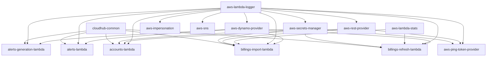

# CloudHub

[![AppHub Application 220544](https://img.shields.io/badge/AppHub-220544-fb6c04.svg?labelColor=3c4b64&logo=data:image/svg+xml;base64,PHN2ZyB4bWxucz0iaHR0cDovL3d3dy53My5vcmcvMjAwMC9zdmciIHhtbDpzcGFjZT0icHJlc2VydmUiIGlkPSJMYXllcl8xIiB4PSIwIiB5PSIwIgoJc3R5bGU9ImVuYWJsZS1iYWNrZ3JvdW5kOm5ldyAwIDAgNzUuMyA4MSIgdmVyc2lvbj0iMS4xIiB2aWV3Qm94PSIwIDAgNzUuMyA4MSI+PHN0eWxlPi5zdDB7ZmlsbDojZmI2YzA0fTwvc3R5bGU+Cgk8cGF0aCBkPSJNMjQuMjcgMi45MWMtMi4zNiAxLjQ5LTIuOCA0LjY1LS45NCA2Ljg3IDIuMjkgMi43MiA2LjgzIDEuODkgNy44MS0xLjQyLjk0LTMuMTItLjgtNS44MS0zLjkyLTYuMDctMS4zMi0uMTEtMi4wNC4wMy0yLjk1LjYyek0yNi44OSAxMy45OGMtLjIyLjg3LS4xNSAxLjM0LjYyIDQuMjEuNCAxLjU2IDEuNDIgMiAyLjU0IDEuMDkuNzMtLjU4LjczLS43My4yOS0yLjk0LS41MS0yLjgzLS44NC0zLjI3LTIuMTgtMy4yNy0uOC4wMS0xLjA5LjIyLTEuMjcuOTF6TTY1LjYxIDE0Ljc1Yy0yLjc2IDEuMi00LjM2IDMuNDktNC4zNiA2LjI1djEuNzRsLTIuNjIgMS40OWMtMS40NS44LTYuMDcgMy4zOC0xMC4yNCA1LjdsLTcuNTYgNC4yNS0uOC0uNzNjLS40NC0uNC0xLjYtMS4wOS0yLjU4LTEuNTYtMy41Ni0xLjYtOC4wMy0uOC0xMC43OSAxLjk2LTIuMDMgMi4wNy0yLjY1IDMuNy0yLjY1IDcuMDEgMCAyLjUxLjE1IDMuMTIuOTggNC42MSAxLjE2IDEuOTMgMy4yIDMuNzQgNC45NCA0LjM2IDEuMTMuNCAxLjIuNTQgMS4wMiAxLjc0LS4xMS42OS0uMjkgMy45Mi0uNDQgNy4xOWwtLjI1IDUuOTItMS4xMy40N2MtMS41My42Mi0zLjM0IDIuOC0zLjg5IDQuNTQtLjkxIDMuMDkuNjkgNi44MyAzLjUyIDguMjEgMS44OS45MSA1LjEyLjkxIDYuNjgtLjA0LjY1LS4zNiAxLjcxLTEuMzEgMi4zMi0yLjA3Ljk0LTEuMiAxLjEzLTEuNzQgMS4yMy0zLjgxLjExLTIuOTQtLjc2LTQuNzYtMy4wMS02LjI4bC0xLjQ1LS45OC4zNi02Ljk3LjM2LTcuMDEgMi41NC0xLjMxYzEuOTMtMS4wMiAyLjgzLTEuNzQgMy43LTMuMDUgMS4zMS0xLjk2IDIuMDMtNC44NyAxLjc0LTYuOTdsLS4yNS0xLjQ1IDEwLjEtNS42NyAxMC4wNi01LjY3IDEuNDkuODRjMy45MiAyLjI1IDkuMjMuMDcgMTAuNDItNC4yOSAxLjUyLTUuNTUtNC4yMS0xMC42Ny05LjQ0LTguNDJ6bTQuMzUgMy4yM2MxLjQ1Ljc2IDIuMzIgMi40NyAyLjAzIDQuMDMtLjMzIDEuNjMtMi4wNyAzLjA1LTMuODEgMy4wNS0zLjc4IDAtNS4zLTQuOTgtMi4wNy02Ljk0IDEuMzgtLjgzIDIuNDQtLjg3IDMuODUtLjE0ek0zNS41NyAzNS43NGMyLjggMS4xNiA0LjA3IDQuMTQgMi45OCA2Ljk0LS44IDIuMTEtMi4yOSAzLjItNC42OSAzLjM0LTUuODUuNDQtNy45NS03LjY2LTIuNjItMTAuMSAxLjc4LS44IDIuNzYtLjgzIDQuMzMtLjE4em0tMi4xNSAzMi4zM2MyLjUxIDEuMDUgMy4yIDMuOTIgMS40NSA1Ljk5LTEuNzQgMi4wNy00LjkgMS43MS02LjE0LS42OS0xLjM0LTIuNjItLjA3LTQuODMgMy4zOC01Ljc4LjA0LS4wMy42Ni4xOSAxLjMxLjQ4ek0yOS4xNCAyMi43NGMtLjY5LjY1LS42OS41NC0uMTggMy4yNy40NyAyLjQ3Ljg0IDMuMDUgMS45NiAzLjA1IDEuNDkgMCAxLjc4LS44IDEuMjctMy40NS0uNjItMy4yNC0xLjcxLTQuMjUtMy4wNS0yLjg3ek02LjE0IDQxLjQ0Yy0xLjQ1LjI5LTIuMTguODQtMi44NyAyLjE4LTEuMTMgMi4yMi0uMzYgNS4wNSAxLjY3IDYuMjggMS45NiAxLjEzIDUuMjcuNDcgNi4yMS0xLjI3IDIuMTktNC4xMy0uNjEtOC4xMy01LjAxLTcuMTl6TTE4LjAyIDQyLjM5Yy0yLjguNjUtMy40NSAxLjE2LTMuMTIgMi40LjMzIDEuMzEgMS4wOSAxLjQyIDQuMjEuNjkgMi41OC0uNTggMi43Mi0uNjkgMi44My0xLjcxLjExLS45NC0uNjUtMi4wNy0xLjM0LTEuOTYtLjExIDAtMS4yNy4yOS0yLjU4LjU4eiIgY2xhc3M9InN0MCIvPjxwYXRoIGQ9Ik00MS4xNiA0OC45M2MtLjE1LjExLS4yNS42NS0uMjUgMS4yIDAgMS4wNSAzLjQxIDQuNzIgNC40IDQuNzIuOCAwIDEuNDItLjczIDEuNDItMS42NyAwLTEuMjMtMy4xMi00LjUtNC4zMi00LjUtLjU2LS4wMS0xLjE0LjEtMS4yNS4yNXpNNDguNDIgNTYuNTVjLS43My43My0uMTUgMi4yMiAxLjYzIDQuMDMgMiAyLjA3IDIuOTEgMi4yOSAzLjgxLjk0LjQ3LS43My4zNi0uOTQtMS4zOC0zLjAxLTEuNDItMS43MS0yLjA3LTIuMjItMi44My0yLjIyLS41NC4wMS0xLjEyLjEyLTEuMjMuMjZ6TTU3LjcyIDYyLjczYy0uNDcuMDctMS4zMS42NS0xLjkzIDEuMj\MtMy44OSAzLjkyIDEuMjMgMTAuMjEgNS44NSA3LjEyIDIuNTEtMS42NyAyLjcyLTUuODEuNC03LjQ4LTEuMDgtLjc2LTMuMDEtMS4xNi00LjMyLS44N3oiIGNsYXNzPSJzdDAiLz4KPC9zdmc+Cg==)](https://apphub.rockettech.tools/applications/220544/general)
[](https://github.com/RocketMortgage/cloudhub/actions/workflows/main.yml)
[](https://dev.azure.com/RocketCompanies/aac50f37-2934-4797-917f-d7939e428d5f/_boards/board/t/8171f9f6-aef6-4aff-b29c-a05bd056b3d6/Stories/)

This is a monorepo for all things CloudHub.

## Projects

* Documentation
  * cloudhub-documentation
  * project-overview
* User Interface
  * cloudhub-ui
* API
  * cloudhub-api
* Infrastructure
  * cloudhub-k8-terraform
  * cloudhub-terraform
* Lambdas
  * accounts-lambda
  * alerts-generation-lambda
  * alerts-lambda
  * billings-import-lambda
  * billings-refresh-lambda
  * cache-refresh-lambda
  * communication-generation-lambda
  * communications-lambda
  * companies-lambda
  * compliance-lambda
  * compliance-realtime-lambda
  * compliance-refresh-lambda
  * event-scheduler-lambda
  * release-trains-lambda
  * settings-lambda
  * stacksets-lambda
  * stacksets-refresh-lambda
  * streams-lambda
* Datastores
  * cloudhub-database
* Packages (Common/Shared Code)
  * aws-dynamo-provider
  * aws-impersonation
  * aws-lambda-logger
  * aws-lambda-stats
  * aws-rest-provider
  * aws-secrets-manager
  * aws-sns
  * cloudhub-common

## Architecture (INCOMPLETE)



## Helpful Commands

* `npm run install:all` - Run `npm install` in all subprojects
<!-- * `npm run pack:all` - run `npm pack` in all subprojects -->
* `npm run pack:packages` - run `npm pack` in all subprojects that are packages
* `npm version:all <version>` - update the version for all packages and dependencies

### VSCode

If you are opening this project in VSCode there are launch configurations
to run both the CloudHub API and the CloudHub UI. If you are using the
`cloudhub.code-workspace` workspace file there is also a composite launch
configuration that will run both simultaneously.

## Local Packages

Use the following command in any subproject to install a local package in any
subproject. The important part is the `--install-links` flag. This will copy the
package to the `node_modules` instead of using symlinks which seems to have
issues with the outdated version of node currently in use.

```Bash
npm install ../<package-name>/cloudhub-<package-name>-local.tgz --install-links
```

## Links

* [Notification Service - 201773 - CloudHub API](https://notification-service.foc.zone/application/210773)
Various email templates including "Monthly Cloud Spend"
* [SonarQube - RocketMortgage/cloudhub-ui](https://sonarqube.rockfin.com/dashboard?id=QL.220544)
